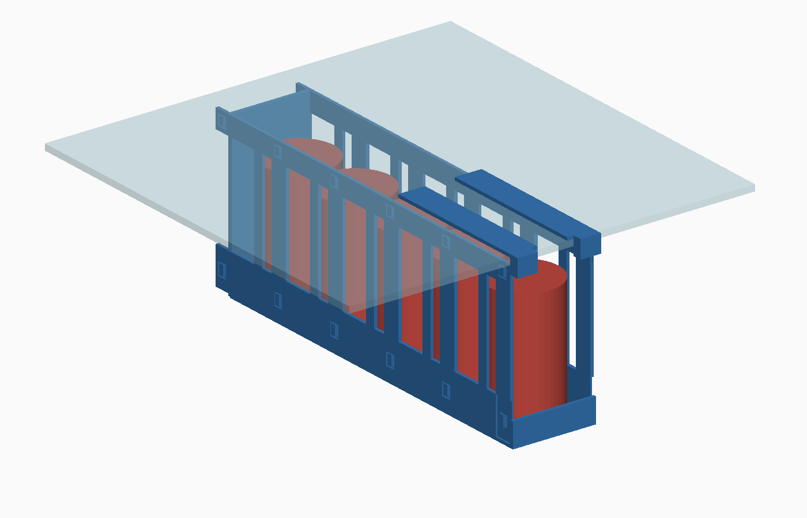
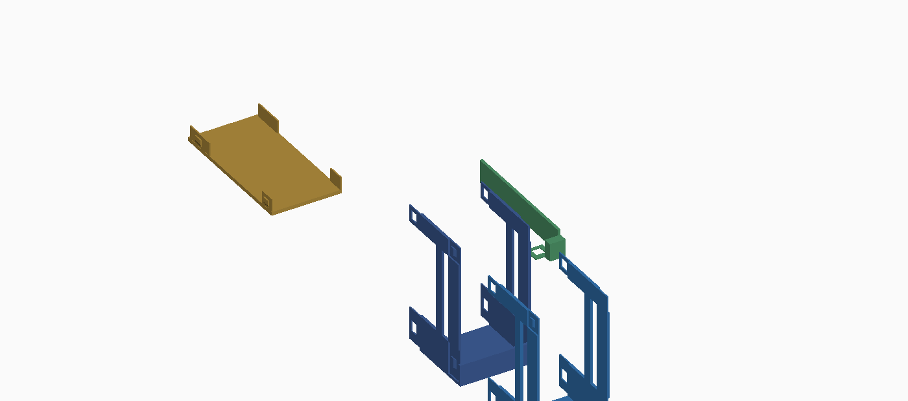

# Fridge Can Rack — hanging 330ml can holder

A modular frame that clips onto the front edge of a glass fridge shelf and
hangs underneath it, holding a single row of 330ml cans **standing upright**.
The row runs **front to back** into the fridge, so the rack is only one can
wide (78mm) and leaves the rest of the shelf free.



> Blue = printed rack · red = 330ml cans · translucent = the glass shelf.
> **Interactive 3D:** open [`fridge_can_rack_assembly.stl`](fridge_can_rack_assembly.stl)
> — GitHub renders STL files in a built-in 3D viewer you can spin and zoom.

## How many cans?

A 330ml can is Ø66.3mm. With a 70mm bay pitch (can + a locating ridge) the
rack uses `3 + 5 × 70 + 18 = 371mm` of a **380mm deep** shelf — so **five
cans** is the maximum that fits. A sixth bay would need 441mm.

## Dimensions

| | |
|---|---|
| Assembled size | 78mm wide × 371mm deep × 159mm tall |
| Shelf depth used | 371mm (of 380mm available) |
| Clearance needed **under** the shelf | 150mm |
| Clearance needed **above** the shelf | 3mm (the clip flanges lie flat on the glass) |
| Glass thickness it clamps | 6mm (adjustable — see *Customising*) |
| Capacity | 5 × 330ml cans (Ø66.3 × 115mm), ≈1.8kg |

Check you have **150mm of headroom** under the shelf before printing. If you
have less, lower `LIP_H` and `WALL_H` (see *Customising*).

## How it works

* Two **shelf clips** wrap around the front edge of the glass. Each has a
  140mm flange that lies flat on *top* of the glass, so the load is carried
  by the shelf rather than by a fragile hook.
* Five **can bays** chain backwards under the glass on lap joints with a snap
  bump, forming an open-topped trough. Each bay's side wall is an open frame —
  two horizontal bands joined by posts — which keeps it stiff but light.
* Cans stand upright on the floor of the trough. A 4mm ridge at the front of
  each bay locates the can and stops the row sliding when the door swings.
* The **front bay** carries a 20mm retaining lip so the front can cannot walk
  out. The clip noses sit above the height a can reaches while being lifted
  over that lip, so the mouth of the rack stays clear.
* An **end stop** closes the back.
* Load and unload from the front: lift a can over the lip and stand it in.



## Print it

| Part | STL | Qty | Size |
|------|-----|-----|------|
| Can bay | [`fridge_can_rack_bay.stl`](fridge_can_rack_bay.stl) | **4** | 78 × 88 × 150mm |
| Front can bay (with lip) | [`fridge_can_rack_bay_front.stl`](fridge_can_rack_bay_front.stl) | **1** | 78 × 91 × 150mm |
| Shelf clip, right | [`fridge_can_rack_shelf_clip_right.stl`](fridge_can_rack_shelf_clip_right.stl) | **1** | 27 × 149 × 25mm |
| Shelf clip, left | [`fridge_can_rack_shelf_clip_left.stl`](fridge_can_rack_shelf_clip_left.stl) | **1** | 27 × 149 × 25mm |
| End stop | [`fridge_can_rack_end_stop.stl`](fridge_can_rack_end_stop.stl) | **1** | 78 × 150 × 18mm |

The two clips are mirror images — print one of each, not two of the same.

Every part fits a 220 × 220mm bed and is already saved in its recommended
print orientation with no overhangs — drop the STL into your slicer and print
it as-is. The bays need **150mm of Z height**.

Suggested settings:

* **Material:** PETG or PLA (PETG preferred — tougher, and happier with fridge
  temperatures and condensation).
* **Layer height:** 0.2mm · **Walls:** 4 perimeters · **Infill:** 25–30%.
* **Supports:** none. Add a **brim** for the two shelf clips — they stand on
  a narrow footprint.
* **Note:** `fridge_can_rack_assembly.stl` is a visualisation of the finished
  rack — it is *not* a printable part.

## Assemble it

1. Slide the front (male) lap of one bay into the rear (female) lap of
   another until the snap bumps click into their windows. Start with the
   **front bay** and chain the four plain bays behind it.
2. Push the **end stop** into the rear lap of the last bay.
3. Push a **shelf clip** onto each side at the top of the front bay.
4. Slide the whole rack onto the front edge of the glass shelf: the flanges
   go on top of the glass, the trough hangs underneath.
5. Load cans in from the front, lifting each one over the retaining lip.

If your prints are tight, ease the lap joints with a file; if they are loose,
a drop of superglue or a cable tie through a snap window will lock them
permanently.

## Customising

Edit the constants at the top of
[`generate_fridge_can_rack.py`](generate_fridge_can_rack.py) and re-run it:

| Constant | Default | What it does |
|----------|---------|--------------|
| `GLASS_T` | `6.0` | **Measure your shelf** and set this — it is the clamp gap |
| `SHELF_DEPTH` | `380.0` | Your shelf depth (capacity check) |
| `N_BAYS` | `5` | Bays in the assembly preview; print as many bays as you need |
| `BAY` | `70.0` | Bay pitch — increase for fatter cans |
| `W_IN` | `72.0` | Clear width — increase for fatter cans |
| `WALL_H` | `147.0` | Height of the trough; lower it for a shallow shelf gap |
| `LIP_H` | `20.0` | Front retaining lip height |
| `CAN_H` | `115.0` | Can height, used for the clearance checks |

If you raise `CAN_H` or `LIP_H`, also raise `CLIP_NOSE_Z0` and `WALL_H` so a
can still clears the clip noses while being loaded.

## Regenerate

```bash
python -m venv .venv && source .venv/bin/activate
pip install numpy numpy-stl

python generate_fridge_can_rack.py   # writes the STL files
python render_fridge_can_rack.py     # writes the two PNG visualisations
```
